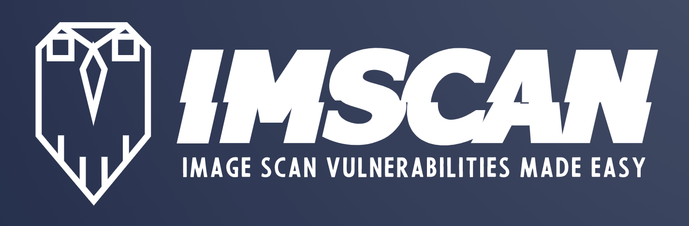
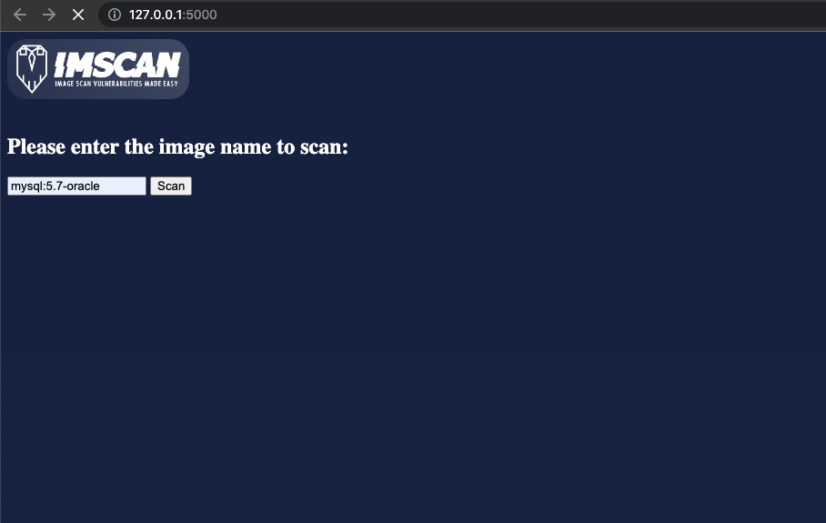
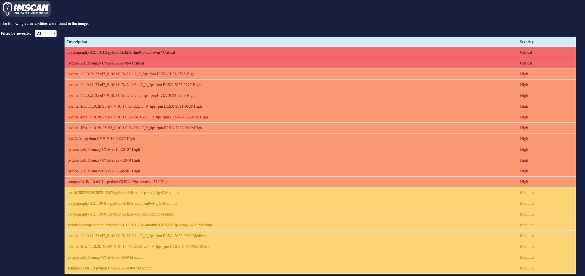
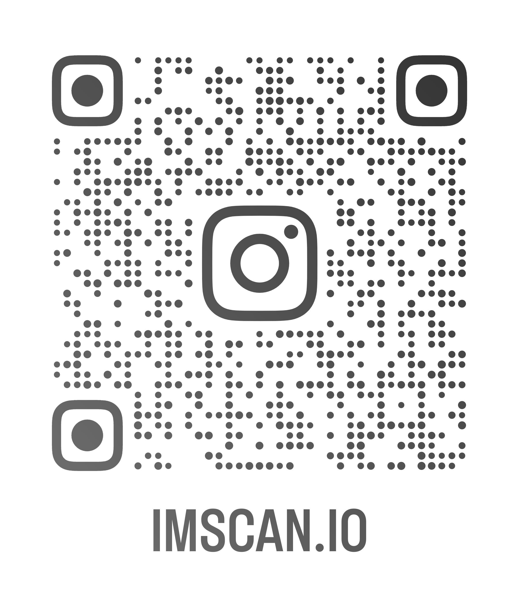

</img>

Open-source project that use Grype to create a Vulnerability scan report for a choosen image.
## Informations  ☕️
- Title:  `image-scanner`
- Author:  `hz59`
- email: [hz59.dev@gmail.com]()

## Install & Dependence  🚀
- python3
- grype: https://github.com/anchore/grype.git 

## Getting started ▶️
- Run:
  ```
  python3 txt2html.py
  ```
- Run 127.0.0.1:5000 in a browser:
  ```
  Please enter the name of the image to scan:
  ```
- Wait until the scan is completed, you'll be redirected to /scan endpoint with the scan report result.

## Directory Hierarchy
```
|—— static/
|—— templates/
|—— txt2html.py
```
## Code supported ☀️
### Tested with
  ```
  - Python: 3.9.5
  - Grype: 0.57.1
    - Syft Version: 0.72.0
  ```

## Features beta version 🔋
| Features | Status |
| ---     | ---   |
| Prompt in the front side with Flask | available beta |
| Scan an image by name/tag | available beta |
| Filter scan report by severity | available beta |

## Next versions ⚗️
| Features | Status |
| ---     | ---   |
| Improve interface | In progress |
| Export scan report PDF/CSV | Soon |
| Docker-compose to launch the project | Next |

## References 🖇
- [https://github.com/anchore/grype.git ]() 🐙
- [https://www.python.org/downloads/]() 🐍

## For contributions 🌟
Create a push request with your branch respecting 'feat/XXXX' of updates related to WIP features (review request is mandatory).

## Samples views
 <p>


### 📲 Support us on social medias
</img>

  #### License
- Open-source project all developed by hz59 / 2023.


